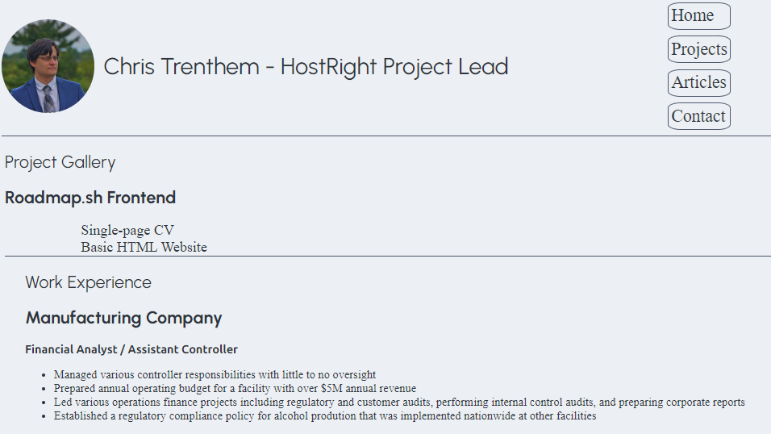

# Basic CV Project

This beginner project adds CSS styling to the previous project.

## Useful Resources & References

-   [Roadmap.sh project page](https://roadmap.sh/projects/basic-html-website)
-   [web.dev (HTML & CSS Tutorials)](https://web.dev/)
-   [Mozilla Developer Network (web language documentation)](https://developer.mozilla.org/en-US/)
-   [CSS Gallery Template by jdias](https://codepen.io/jmldias/pen/DjYdor) - used for the Projects page
-   [Nord color theme](https://www.nordtheme.com/)

## Known Issues (Please open an issue to help!)
